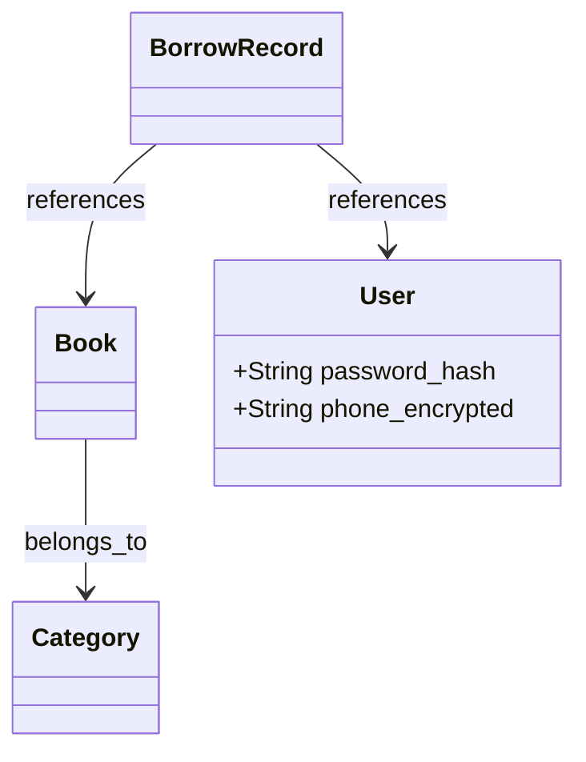

# 图书管理系统 需求分析文档

## 需求背景与目标
- 当前图书馆仍依赖人工登记与纸质借阅卡，存在图书查找效率低、借还记录易丢失、库存状态不实时等问题；
- 亟需构建一个轻量、安全、可扩展的数字化图书管理平台，覆盖图书编目、用户管理、借阅流通及统计分析全流程；
- 目标是提升图书流通效率30%以上，实现借阅操作平均耗时≤15秒，支持并发用户数≥200，数据零丢失。

## 目标用户与核心场景
- **管理员**：执行图书上架、下架、分类维护、用户权限配置、系统日志审计；
- **图书管理员（日常操作员）**：完成借书、还书、续借、逾期催还、在馆状态查询；
- **注册读者**：查看个人借阅历史、预约图书、检索馆藏、接收到期提醒；
- **核心场景**：  
  - 新书入库（ISBN扫描→元数据自动补全→分类归架→生成唯一索书号）；  
  - 借书流程（读者扫码/输入证号→验证有效性→选择图书→生成借阅记录→更新库存状态）；  
  - 逾期处理（系统每日凌晨自动标记逾期记录→触发站内信+短信提醒→生成滞纳金账单）。

## 核心功能需求
- 图书管理：支持ISBN/ISSN批量导入、字段编辑（题名、作者、出版社、出版年、分类号、索书号、馆藏位置、状态）、全文模糊检索；
- 用户管理：读者证号唯一注册、身份分级（学生/教师/访客）、密码策略（8位+大小写字母+数字）、自助重置；
- 借阅管理：单次最多借5册、借期30天、可续借1次（无逾期且未被预约）、扫码快速办理；
- 预约管理：对已借出图书发起预约、按申请时间排队、到书后短信通知、保留72小时；
- 统计报表：按月生成借阅TOP10、各学科借阅分布、逾期率趋势图、图书流通频次热力图；
- 系统管理：操作日志（含操作人、时间、IP、关键参数）、数据备份（每日增量+每周全量）、角色权限矩阵配置。

## 非功能需求
- **性能**：首页加载≤1.2s，图书检索响应≤800ms（万级数据量），借阅事务TPS≥50；
- **安全**：HTTPS强制访问、敏感操作二次验证（短信/邮箱）、SQL注入/XSS防护、读者隐私数据脱敏显示；
- **可靠性**：数据库主从热备、服务宕机自动切换、借阅事务ACID保障、异常中断后状态自恢复；
- **兼容性**：Chrome/Firefox/Edge最新2个版本、iOS 14+/Android 10+、支持A4打印导出PDF报表；
- **可维护性**：提供RESTful API文档（OpenAPI 3.0）、模块化代码结构、错误日志带唯一trace_id。

## 需求优先级
- **P0（必须实现）**：图书CRUD、读者注册/登录、借还书核心流程、基础检索、数据备份；
- **P1（重要但可延期）**：预约功能、逾期自动提醒、统计图表可视化、移动端适配；
- **P2（优化型）**：OCR识别ISBN、RFID批量盘点、多语言界面（中/英）、开放API供第三方集成；
- **P3（远期规划）**：AI荐书引擎、电子资源统一门户、微信小程序轻量版。

## 验收标准
- 所有P0需求100%通过测试用例（含边界值：如借满5册后禁止再借、同一图书同时被3人预约的队列逻辑）；
- 压力测试报告：JMeter模拟200并发用户持续30分钟，错误率＜0.1%，平均响应时间达标；
- 安全扫描报告：OWASP ZAP扫描无高危漏洞（如未授权访问、硬编码密钥）；
- 用户验收测试（UAT）：由3名真实图书管理员完成全流程走查，签署《UAT确认书》；
- 数据迁移验证：从旧Excel台账导入5000条图书数据后，索书号生成规则、分类映射、状态标识100%准确。

## 数据字典

| 字段名 | 数据类型 | 描述 | 约束 |
|--------|----------|------|------|
| `book_id` | UUID | 图书唯一标识符 | 非空，主键，自动生成 |
| `isbn` | VARCHAR(17) | 国际标准书号（含分隔符） | 唯一，格式校验（10或13位） |
| `title` | VARCHAR(200) | 图书题名 | 非空，长度≤200 |
| `status` | ENUM('in_stock','borrowed','reserved','lost','archived') | 当前流通状态 | 非空，默认'in_stock' |
| `due_date` | DATE | 应还日期（仅借阅中记录） | 可为空，格式YYYY-MM-DD |

