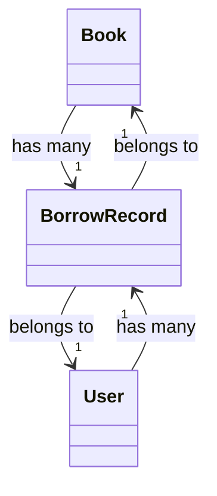

# 图书管理系统 需求分析文档

## 需求背景与目标
- 当前图书馆仍依赖手工登记与纸质借阅卡，导致图书查找效率低、借还记录易丢失、库存统计滞后；
- 目标是构建一个轻量、稳定、易维护的Web端图书管理系统，支持图书全生命周期管理（录入、检索、借阅、归还、报废）；
- 实现管理员与普通用户双角色协同，提升图书流通率与数据准确性，为后续数据分析提供结构化基础。

## 目标用户与核心场景
- **管理员**：负责图书上架、用户权限配置、逾期提醒设置、报表导出；
- **注册读者（普通用户）**：浏览馆藏、预约图书、查看个人借阅历史、续借未逾期书籍；
- **核心场景**：
  - 新书入库：扫描ISBN自动填充元数据，人工补全分类与馆藏位置；
  - 借书流程：用户扫码/输入ISBN → 系统校验可借状态 → 绑定借阅记录 → 更新库存；
  - 逾期处理：系统每日凌晨自动标记逾期记录，并向用户推送站内信+邮件提醒；
  - 模糊检索：支持按书名关键词、作者拼音首字母、ISBN前缀、分类标签组合查询。

## 核心功能需求
- 图书管理：增删改查图书信息，支持批量导入（CSV）、ISBN自动识别、封面图片上传；
- 用户管理：读者注册/审核、角色分配（管理员/普通用户）、密码策略与登录日志；
- 借阅管理：借书、还书、预约、续借操作，实时更新图书状态（在馆/借出/预约中/编目中）；
- 分类与标签：支持多级图书分类（如“计算机 > 人工智能 > 机器学习”）及自定义标签（如“馆藏推荐”“新书速递”）；
- 报表统计：生成月度借阅TOP10、各分类流通率、用户活跃度、逾期率等可视化图表（前端渲染）；
- 系统通知：借阅成功/逾期/预约到书等事件触发站内信与邮件双通道提醒。

## 非功能需求
- **性能**：首页加载 ≤1.5s；万级图书库下关键词检索响应 ≤800ms；
- **安全**：密码加密存储（bcrypt），JWT鉴权，敏感操作（如删除图书）需二次确认+管理员审批日志；
- **兼容性**：支持Chrome/Firefox/Edge最新两个版本，适配移动端（响应式布局）；
- **可靠性**：关键事务（借还书）具备数据库事务保障，每日凌晨自动备份至本地+云存储；
- **可维护性**：API接口遵循RESTful规范，提供Swagger文档，日志分级（INFO/）并按天轮转。

## 需求优先级
- **P0（必须实现）**：图书CRUD、用户登录与角色控制、借还书核心流程、基础检索、数据备份；
- **P1（重要但可延期）**：预约功能、邮件通知、多级分类、CSV批量导入；
- **P2（优化型）**：续借、标签管理、可视化报表、移动端专属UI、OCR ISBN识别。

## 验收标准
- 所有P0功能通过完整业务流测试（如：新书入库→读者借阅→管理员还书→库存同步更新）；
- 系统在模拟200并发用户下，借阅事务成功率 ≥99.9%，无数据不一致现象；
- 提供完整测试用例集（含边界值：ISBN格式校验、超期续借拦截、空搜索词处理）；
- 输出符合ISO/IEC/IEEE 29148标准的《需求规格说明书》PDF与可执行原型链接；
- 通过第三方渗透测试（OWASP ZAP扫描），高危漏洞（如SQL注入、XSS）清零。

## 数据字典

| 字段名 | 数据类型 | 描述 | 约束 |
|--------|----------|------|------|
| `book_id` | UUID | 图书唯一标识符 | 主键，非空，自动生成 |
| `isbn` | VARCHAR(17) | 国际标准书号（支持10/13位） | 唯一，格式正则校验 `^\d$|^\d$` |
| `title` | VARCHAR(200) | 图书标题 | 非空，长度1-200 |
| `author` | VARCHAR(100) | 作者姓名（多作者用分号分隔） | 允许为空，长度≤100 |
| `status` | ENUM | 当前状态：`in_stock`/`borrowed`/`reserved`/`archived` | 非空，默认`in_stock` |

