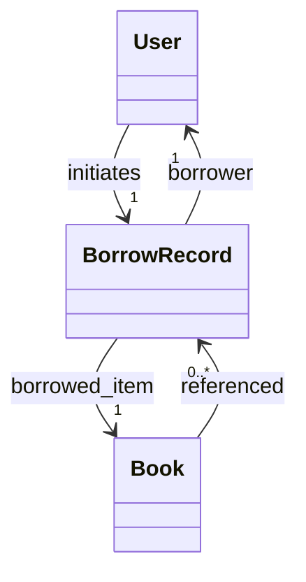

# 图书管理系统 需求分析文档

## 需求背景与目标  
- 当前图书馆仍依赖手工登记与Excel管理，存在借阅记录易丢失、图书状态不透明、检索效率低等问题；  
- 目标是构建一个支持多角色协同、数据实时同步、操作可追溯的Web端图书管理系统；  
- 实现图书全生命周期管理（采购→编目→上架→借阅→归还→下架），提升管理效率30%以上，降低人工错误率至<0.5%。

## 目标用户与核心场景  
- **管理员**：负责图书录入、用户权限配置、系统日志审计；  
- **图书管理员**：执行借还操作、库存盘点、逾期催还；  
- **普通读者**：在线检索图书、查看借阅历史、预约未在馆图书；  
- **核心场景**：  
  - 读者扫码快速借书（5秒内完成）；  
  - 管理员批量导入ISBN生成标准化书目；  
  - 系统自动标记超期未还图书并触发邮件通知；  
  - 多终端实时同步库存状态（PC/平板/自助终端）。

## 核心功能需求  
- **图书管理**：支持ISBN/ISSN自动识别、分类（中图法）、多维度检索（标题/作者/ISBN/主题词）、封面上传、状态标记（在馆/借出/遗失/编目中）；  
- **用户管理**：角色分级（超级管理员/图书管理员/读者）、学工号绑定、密码策略（8位+大小写字母+数字）、登录失败锁定机制；  
- **借阅管理**：借阅/归还扫码操作、预约队列自动排序、逾期计算（按自然日）、续借限制（最多1次）；  
- **报表统计**：借阅TOP10图书周报、各院系借阅量对比图、图书流通率分析（借阅次数/在馆时长）；  
- **系统集成**：对接校园统一身份认证（CAS）、支持OPAC标准协议对外提供元数据服务。

## 非功能需求  
- **性能**：支持500并发用户，图书检索响应时间≤1.2s（95%分位），单日处理借还操作≥5000笔；  
- **安全**：所有敏感数据（密码、身份证号）AES-256加密存储，API接口强制JWT鉴权，SQL注入/XSS防护全覆盖；  
- **可靠性**：数据库每日全量备份+每小时增量备份，故障恢复RTO≤15分钟，RPO=0；  
- **兼容性**：Chrome/Firefox/Edge最新2个版本，移动端适配iOS/Android主流浏览器；  
- **可维护性**：提供RESTful API文档（Swagger）、模块化前端组件、日志分级（DEBUG/INFO/WARN/）。

## 需求优先级  
- **P0（必须实现）**：图书CRUD、用户角色管理、借阅/归还核心流程、基础检索、CAS单点登录；  
- **P1（重要但可延期）**：预约功能、自动催还邮件、多维度统计报表、OPAC接口；  
- **P2（优化项）**：移动端PWA应用、RFID硬件对接、AI荐书算法、多语言界面（中/英）。

## 验收标准  
- 所有P0需求100%通过测试用例（含边界值：如ISBN校验码错误、超期100天借阅记录）；  
- 压力测试报告证明500并发下错误率<0.1%，平均响应时间达标；  
- 安全扫描工具（OWASP ZAP）无高危漏洞（CVSS≥7.0）；  
- 管理员可导出符合《GB/T 3792.2-2019 文献著录规则》的MARC21格式数据包；  
- 用户培训手册覆盖全部P0/P1功能，实操考核通过率≥95%。

## 数据字典  

| 字段名 | 数据类型 | 描述 | 约束 |
|--------|----------|------|------|
| `book_id` | UUID | 图书唯一标识符 | 主键，非空，自动生成 |
| `isbn13` | CHAR(13) | 国际标准书号（13位） | 唯一，正则校验 `^\d$` |
| `title` | VARCHAR(200) | 图书标题 | 非空，长度1-200 |
| `status` | ENUM | 当前状态 | 取值：`in_stock`, `borrowed`, `reserved`, `lost`, `processing` |
| `due_date` | DATE | 应还日期 | 允许为空（仅借出状态必填） |

