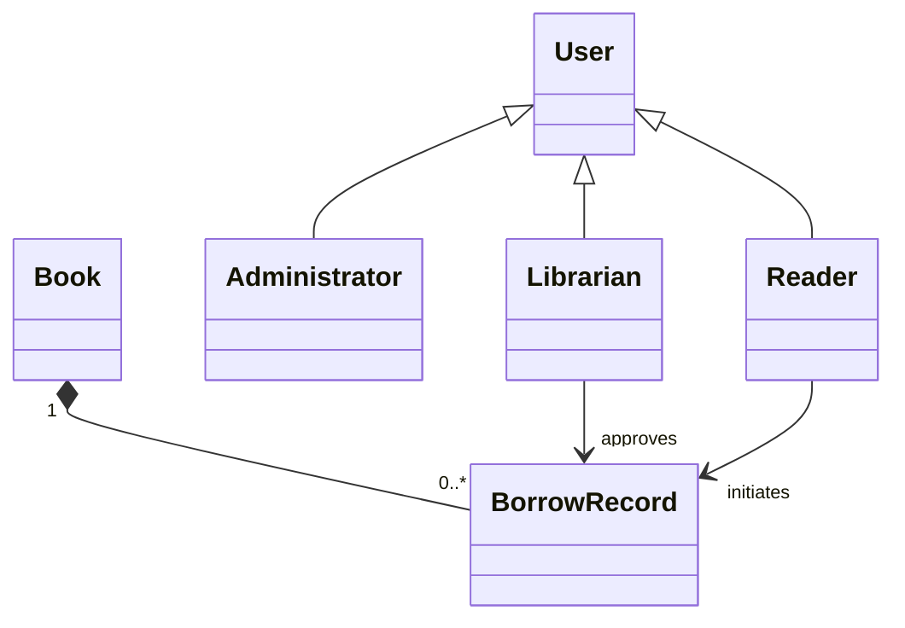

# 图书管理系统 需求分析文档

## 需求背景与目标  
- 图书馆及中小型书店亟需数字化管理图书资源、借阅流程与用户信息，替代传统手工登记方式；  
- 目标是构建一个安全、稳定、易用的B/S架构系统，支持图书全生命周期管理（录入、检索、借还、统计）；  
- 实现管理员、图书管理员、普通读者三类角色的权限隔离与协同操作；  
- 提升图书流通效率，降低人工错误率，为决策提供实时数据支撑。

## 目标用户与核心场景  
- **管理员**：负责系统配置、角色权限分配、数据备份与日志审计；  
- **图书管理员**：执行图书上架、下架、分类调整、借阅审核、逾期催还等日常运维；  
- **普通读者（注册用户）**：浏览图书目录、预约/借阅/归还图书、查看个人借阅历史与逾期状态；  
- **核心场景示例**：  
  - 读者通过ISBN快速检索并预约一本在馆图书；  
  - 图书管理员批量导入新书元数据并自动分配索书号；  
  - 系统每日凌晨自动生成“逾期未还TOP10读者”报表并邮件通知管理员。

## 核心功能需求  
- **用户管理**：支持读者自助注册（含实名认证）、管理员审核、角色分级（admin/librarian/user）、密码策略与账户锁定；  
- **图书管理**：支持ISBN/ISSN校验录入、多字段检索（标题/作者/ISBN/分类号/出版社）、封面上传、状态标记（在馆/借出/遗失/编目中）；  
- **借阅管理**：借阅申请→图书管理员审核→生成借阅记录→自动更新图书状态；支持扫码借还、批量操作、续借（≤2次）与预约排队；  
- **统计报表**：按月生成借阅量趋势图、热门图书TOP20、读者活跃度分布、逾期率统计；支持导出PDF/Excel；  
- **系统管理**：操作日志追踪（谁、何时、对何资源、执行何操作）、数据定期自动备份（本地+云存储可选）、基础参数配置（最大借阅数、最长借期、逾期罚金规则）。

## 非功能需求  
- **性能**：支持≥500并发用户；图书列表页响应时间≤1.5s（万级数据量）；  
- **安全**：密码加密存储（bcrypt）、JWT令牌鉴权、关键操作二次确认、SQL注入/XSS防护、敏感操作留痕；  
- **兼容性**：适配Chrome/Firefox/Edge最新两个版本，支持移动端响应式布局；  
- **可靠性**：核心事务（如借阅）具备ACID特性；单点故障不影响基础查询服务；  
- **可维护性**：模块化设计，API接口文档完备（OpenAPI 3.0），日志分级（INFO/WARN/）可配置。

## 需求优先级  
- **P0（必须实现）**：用户登录与角色控制、图书CRUD、借阅/归还核心流程、基础检索、数据备份；  
- **P1（重要但可延期）**：预约排队机制、自动化逾期提醒（邮件/站内信）、多维度统计图表、ISBN自动元数据抓取（对接国家图书馆API）；  
- **P2（优化项）**：微信小程序端、RFID扫码集成、读者荐购功能、AI图书推荐引擎。

## 验收标准  
- 所有P0功能通过完整业务流测试（如：读者A成功借阅→图书状态变“借出”→管理员后台可见记录→归还后状态恢复“在馆”）；  
- 系统连续72小时无崩溃，平均可用性≥99.5%；  
- 安全扫描无高危漏洞（OWASP Top 10）；  
- 压力测试下，500并发用户时关键事务成功率≥99.9%；  
- 提供完整用户手册、API文档及部署指南，管理员可独立完成初始化配置与日常维护。

## 数据字典  

| 字段名 | 数据类型 | 描述 | 约束 |
|--------|----------|------|------|
| `book_id` | UUID | 图书唯一标识符 | 主键，非空，自动生成 |
| `isbn13` | CHAR(13) | 国际标准书号（13位数字） | 唯一，格式正则校验 `^\d$` |
| `title` | VARCHAR(200) | 图书标题 | 非空，长度1-200 |
| `status` | ENUM | 当前状态：'in_stock','borrowed','lost','processing' | 非空，默认'in_stock' |
| `due_date` | DATE | 应归还日期（仅借阅记录中有效） | 可为空，若非空则 ≥ 借阅日期 |

