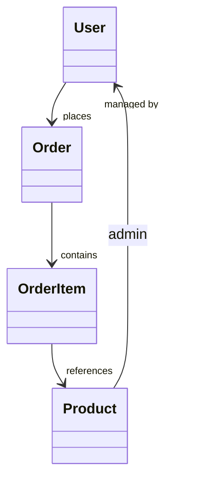

# 购物管理系统 需求分析文档

## 需求背景与目标  
- 传统线下零售与小型电商团队缺乏一体化商品、订单、库存协同管理工具，导致人工对账耗时、库存误差率高、客户订单响应滞后；  
- 本系统旨在提供轻量级、可快速部署的购物管理平台，覆盖商品上架、订单履约、库存预警、基础报表四大核心闭环；  
- 目标是将订单处理时效提升至≤5分钟，库存盘点准确率提升至≥99.5%，支持单日1000+订单稳定运行。

## 目标用户与核心场景  
- **目标用户**：中小型实体店铺店主、社区团购团长、个体电商运营者、兼职客服人员；  
- **核心场景**：  
  - 店主在收银后30秒内完成订单创建与支付标记；  
  - 库存低于安全阈值时，系统自动向管理员推送微信/站内信告警；  
  - 客服通过订单号一键查询商品状态、物流信息及历史沟通记录；  
  - 每日凌晨自动生成昨日销售TOP10商品与滞销商品报表（PDF+Excel双格式）。

## 核心功能需求  
- **商品管理**：支持SKU级录入（含多规格）、分类树维护、上下架状态切换、批量导入导出（Excel模板）；  
- **订单管理**：支持手动创建/扫码创建订单、多支付方式（微信、支付宝、货到付款）标记、订单状态机（待支付→已支付→配货中→已发货→已完成→已退款）；  
- **库存管理**：实时库存扣减（下单即锁库）、安全库存阈值配置、出入库流水追溯、库存调拨（跨仓库）；  
- **会员管理**：手机号唯一注册、消费积分累计与兑换、等级自动升降（按累计消费额）；  
- **数据看板**：折线图展示近7日销售额趋势、饼图展示品类销售占比、表格呈现实时库存预警清单。

## 非功能需求  
- **性能**：首页加载≤1.2s（Chrome 90+，4G网络），订单列表分页查询≤300ms（万级数据）；  
- **安全**：所有API接口强制JWT鉴权，敏感操作（如库存修改）需二次短信验证；  
- **兼容性**：前端适配Chrome/Firefox/Safari最新2个版本，移动端适配iOS 14+/Android 10+；  
- **可靠性**：数据库每日凌晨自动全量备份+每小时增量备份，RPO≤5分钟，RTO≤15分钟；  
- **可维护性**：提供标准OpenAPI v3.0文档，关键业务逻辑模块化封装，支持热插拔式报表引擎扩展。

## 需求优先级  
- **P0（必须上线）**：商品CRUD、订单全流程状态管理、实时库存扣减、登录与权限控制；  
- **P1（首期迭代）**：微信消息告警、销售报表生成、会员积分体系、Excel批量导入；  
- **P2（二期规划）**：多仓库协同、供应商管理模块、AI销量预测、小程序端收银POS集成；  
- **P3（远期探索）**：AR商品预览、语音指令下单、区块链溯源对接。

## 验收标准  
- 所有P0功能100%通过测试用例（含边界值：如库存=0时禁止下单、负数金额拦截）；  
- 压力测试下，模拟200并发用户持续操作30分钟，系统错误率＜0.1%，无内存泄漏；  
- 提供完整用户手册（含截图+操作视频二维码）及管理员部署指南（Docker Compose一键部署脚本）；  
- 通过等保二级基础要求（含日志审计、密码复杂度策略、会话超时强制登出）。

## 数据字典  

| 字段名 | 数据类型 | 描述 | 约束 |
|--------|----------|------|------|
| `product_id` | UUID | 商品唯一标识符 | 主键，非空，自动生成 |
| `sku_code` | VARCHAR(64) | 商家自定义SKU编码 | 唯一，非空，长度≤64 |
| `stock_quantity` | INT | 当前可用库存数量 | ≥0，默认0 |
| `safe_stock_level` | INT | 安全库存阈值 | ≥0，默认10 |
| `order_status` | ENUM('pending','paid','packing','shipped','completed','refunded') | 订单状态枚举值 | 非空，仅限枚举值 |

