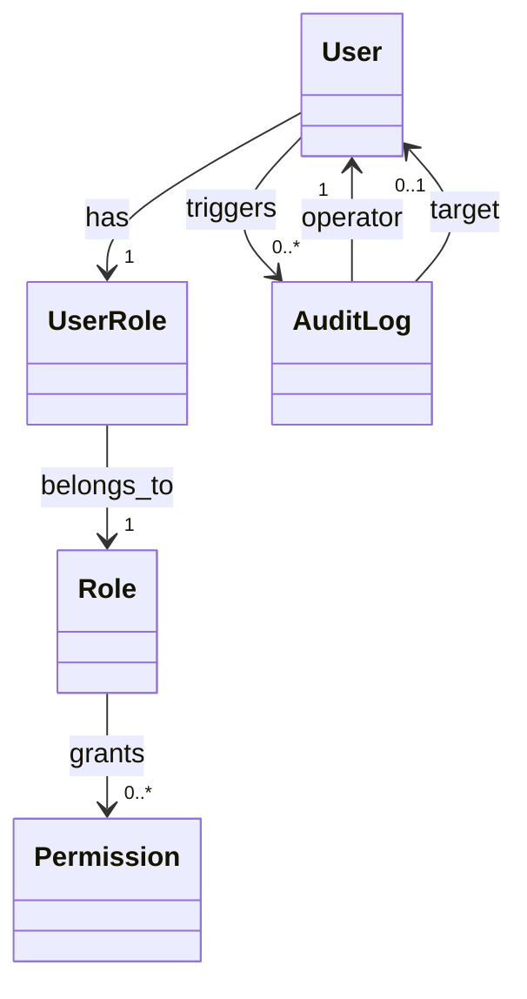

# 用户管理系统 需求分析文档

## 需求背景与目标
- 企业需统一管理内部员工、外部合作方及系统管理员等多角色用户，替代现有分散的Excel台账与手工审批流程；
- 目标是构建安全、可审计、支持高并发访问的Web端用户生命周期管理平台，支撑后续权限中心与单点登录（SSO）集成；
- 实现用户从注册/入职、信息维护、角色分配、状态变更（启用/停用/离职）到数据归档的全流程数字化闭环。

## 目标用户与核心场景
- **系统管理员**：负责全局配置、角色权限定义、审计日志查看及异常账号处置；
- **部门负责人**：发起本部门员工入职/转岗/离职申请，审批下属信息修改请求；
- **普通员工**：自助更新联系方式、紧急联系人、头像等非敏感信息，查看个人权限范围；
- **HR专员**：批量导入新员工数据、同步组织架构变更、导出合规性报表（如GDPR数据留存清单）；
- **核心场景**：新员工入职自动创建账号并分配初始角色；员工离职时自动禁用账号并触发权限回收任务；敏感字段（如身份证号）加密存储且操作留痕。

## 核心功能需求
- **用户全生命周期管理**：支持CRUD操作，含软删除（status字段标记）、历史版本快照（保留最近3次修改记录）；
- **多维度身份认证**：支持用户名/手机号/邮箱登录，强制首次登录修改密码，集成短信验证码与邮箱验证；
- **RBAC权限模型**：角色可绑定多个权限项（如“用户查看”“用户编辑”“日志导出”），支持角色继承（如“高级管理员”继承“普通管理员”全部权限）；
- **组织架构管理**：树形结构维护部门、岗位、职级，支持拖拽调整上下级关系，用户可归属多个部门（主部门+兼职部门）；
- **审计与合规**：所有关键操作（创建/修改/删除/启用/禁用）生成不可篡改日志，包含操作人IP、时间、前后字段值对比；
- **数据导入导出**：支持Excel模板批量导入（含字段校验与错误行高亮反馈），导出结果按筛选条件动态生成CSV/Excel。

## 非功能需求
- **性能**：单节点支持5000+并发用户，用户列表分页查询（100条/页）响应时间≤800ms；
- **安全**：密码使用bcrypt加盐哈希存储；敏感字段（身份证、手机号）AES-256加密；所有API强制HTTPS；
- **可用性**：核心服务SLA 99.9%，故障自动切换至备用数据库（主从延迟≤500ms）；
- **兼容性**：前端适配Chrome/Firefox/Edge最新2个大版本，支持移动端浏览器触控操作；
- **可维护性**：提供OpenAPI 3.0规范文档，关键业务逻辑模块化封装，支持热更新配置项（如密码策略）。

## 需求优先级
- **P0（必须实现）**：用户CRUD、RBAC权限分配、登录认证、审计日志、基础组织架构树；
- **P1（重要但可延期）**：批量导入导出、多部门归属、历史版本快照、密码策略自定义；
- **P2（优化型）**：SSO对接（OIDC协议）、操作审批工作流（如离职需HR+IT双审批）、BI数据看板。

## 验收标准
- 所有P0功能通过Postman自动化测试集（覆盖率≥95%），无P0级缺陷；
- 审计日志完整记录10类关键操作，且可通过时间范围/操作人/目标用户三重条件精准检索；
- 压力测试下，5000并发用户持续操作30分钟，系统错误率＜0.1%，平均响应延迟达标；
- 敏感字段加密验证：数据库直查身份证字段为密文，解密接口仅限审计角色调用且记录日志；
- 导入功能支持10万行Excel解析，错误提示精确到单元格坐标（如“A2列手机号”）。

## 数据字典

| 字段名 | 数据类型 | 描述 | 约束 |
|--------|----------|------|------|
| user_id | UUID | 用户唯一标识符 | 非空，主键 |
| username | VARCHAR(50) | 登录用户名（唯一） | 非空，唯一，仅字母数字下划线 |
| email | VARCHAR(255) | 邮箱地址 | 非空，唯一，符合RFC 5322格式 |
| phone | VARCHAR(20) | 加密存储的手机号 | 可空，AES-256加密 |
| id_card | TEXT | 加密存储的身份证号 | 可空，AES-256加密，仅管理员可解密 |
| status | ENUM('active','inactive','archived') | 账号状态 | 非空，默认'active' |
| created_at | DATETIME | 创建时间（UTC） | 非空，自动填充 |
| updated_at | DATETIME | 最后更新时间（UTC） | 非空，自动更新 |

