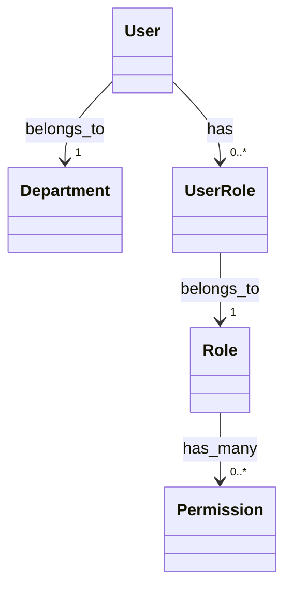

# 用户管理系统 需求分析文档

## 需求背景与目标
- 企业需统一管理内部员工、外部合作方及系统管理员等多角色用户，替代现有分散的Excel登记与手动权限配置方式；
- 目标是构建安全、可扩展、符合等保2.0基础要求的Web端用户生命周期管理平台；
- 实现用户注册/入职、信息维护、角色授权、状态管控（启用/停用/离职）、登录审计全链路数字化。

## 目标用户与核心场景
- **系统管理员**：批量导入/导出用户、分配全局角色、查看全量操作日志；
- **部门主管**：审核本部门成员入职/转岗申请、重置下属密码、查看部门用户列表；
- **普通用户**：自助修改联系方式、头像、密码；查看个人权限范围与登录记录；
- **核心场景**：新员工入职自动创建账号并分配初始角色；员工离职时一键冻结账号并回收权限；敏感操作（如删除用户）需双人复核。

## 核心功能需求
- 用户CRUD操作：支持手机号/邮箱唯一性校验、密码强度策略（8位以上含大小写字母+数字）、实名认证（身份证号脱敏存储）；
- 角色与权限管理：RBAC模型，预置“超级管理员”“部门主管”“普通用户”角色，支持自定义角色并绑定菜单级/按钮级权限；
- 组织架构管理：树形结构维护部门、岗位、汇报关系，支持拖拽调整层级；
- 登录与会话控制：JWT鉴权、登录失败5次锁定30分钟、强制登出其他终端、会话超时15分钟；
- 审计日志：记录关键操作（创建用户、修改角色、重置密码、登录成功/失败），字段含操作人、IP、时间、影响对象、操作详情；
- 数据导入导出：支持Excel模板批量导入用户（含部门/角色映射），导出支持按部门/状态/时间范围筛选。

## 非功能需求
- 性能：单页加载用户列表（≤10,000条）响应时间＜1.5秒；并发支持500+用户同时操作；
- 安全：密码加密存储（bcrypt+盐值）、所有API接口HTTPS强制跳转、敏感字段（身份证、手机号）前端脱敏显示（***）；
- 兼容性：Chrome/Firefox/Edge最新2个版本，Safari 15+，适配1920×1080及以上分辨率；
- 可靠性：关键操作（如删除用户）需二次确认+短信验证码验证；数据库每日自动备份+异地冗余；
- 可维护性：提供Docker Compose一键部署脚本，日志按天切割并保留90天。

## 需求优先级
- **P0（必须实现）**：用户增删改查、角色权限分配、组织架构树、JWT登录鉴权、审计日志记录；
- **P1（重要但可延期）**：Excel批量导入导出、部门主管审批流、登录失败锁定机制；
- **P2（建议后续迭代）**：SSO单点登录对接、LDAP同步、用户行为分析看板、API密钥管理。

## 验收标准
- 所有P0功能通过功能测试用例（覆盖正向/边界/异常场景），缺陷率＜0.5%；
- 压力测试下，用户列表查询TPS≥200，错误率＜0.1%；
- 安全扫描无高危漏洞（如SQL注入、XSS、越权访问）；
- 提供完整部署文档、API接口文档（OpenAPI 3.0格式）、用户操作手册（PDF）；
- 通过UAT验收：3个业务部门各指定2名代表完成全流程场景验证并签字确认。

## 数据字典

| 字段名 | 数据类型 | 描述 | 约束 |
|--------|----------|------|------|
| user_id | UUID | 用户唯一标识符 | 主键，非空，自动生成 |
| username | VARCHAR(50) | 登录用户名（工号） | 唯一，非空，长度3-20字符 |
| real_name | VARCHAR(100) | 真实姓名 | 非空，长度2-50字符 |
| phone | VARCHAR(20) | 手机号 | 符合11位中国大陆手机号正则，唯一 |
| email | VARCHAR(255) | 邮箱地址 | 符合RFC 5322邮箱格式，唯一 |
| status | TINYINT | 账户状态（0-禁用，1-启用，2-离职） | 非空，默认值1 |
| department_id | BIGINT | 所属部门ID（关联department表） | 外键，可为空（待分配） |
| created_at | DATETIME | 创建时间 | 非空，自动填充当前时间 |
| updated_at | DATETIME | 最后更新时间 | 非空，自动更新 |

