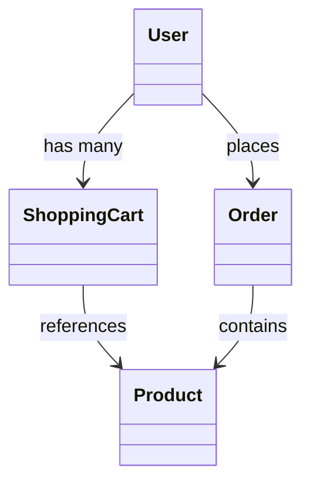

# 购物系统 需求分析文档

## 需求背景与目标  
- 传统线下购物流程效率低、库存难同步、用户行为难追踪，亟需数字化解决方案；  
- 目标构建一个高可用、可扩展的B/S架构购物系统，支持商品浏览、下单支付、订单管理及后台运营；  
- 实现用户端“选—付—查”闭环与商家端“上—管—析”闭环，提升转化率与运营效率。

## 目标用户与核心场景  
- **普通消费者**：浏览商品、加入购物车、在线支付、查看订单物流；  
- **店铺管理员**：上架/下架商品、管理库存、处理售后申请、查看销售报表；  
- **平台运营人员**：审核入驻商家、配置促销活动、监控系统健康度、导出业务数据；  
- **核心场景**：秒杀抢购、跨店满减、退货自动退款、实时库存扣减、多终端（PC/小程序）一致体验。

## 核心功能需求  
- 用户模块：手机号注册/登录、收货地址管理、收藏夹、浏览历史；  
- 商品模块：分类导航、关键词搜索、SKU多规格选择、图文详情页、评价展示与提交；  
- 购物车模块：多商品合并结算、失效商品提示、库存实时校验；  
- 订单模块：生成订单（含优惠计算）、微信/支付宝支付对接、订单状态机（待支付→已发货→已完成→已关闭）、物流信息同步；  
- 后台模块：RBAC权限控制、商品CRUD、订单导出（Excel）、销售趋势图表（ECharts集成）；  
- 系统模块：短信验证码服务、消息中心（站内信+微信模板消息）、操作日志审计。

## 非功能需求  
- 性能：首页加载 ≤1.5s（95%分位），秒杀接口支持 ≥5000 TPS；  
- 可用性：核心链路（下单、支付）全年可用率 ≥99.95%，支持灰度发布；  
- 安全性：密码加密存储（BCrypt）、JWT鉴权、防SQL注入/XSS、支付敏感字段脱敏；  
- 兼容性：Chrome/Firefox/Safari最新2版、iOS/Android主流微信内置浏览器；  
- 可维护性：提供OpenAPI文档（Swagger）、关键接口埋点（Prometheus+Grafana监控）。

## 需求优先级  
- **P0（必须上线）**：用户登录、商品浏览、购物车、下单支付、订单查询、基础后台管理；  
- **P1（首期迭代）**：满减优惠券、物流轨迹展示、售后申请流程、短信登录；  
- **P2（二期规划）**：直播带货接入、AI商品推荐、多语言支持、供应链协同接口；  
- **P3（长期演进）**：AR试穿/试用、区块链溯源、碳积分体系。

## 验收标准  
- 所有P0功能通过完整端到端测试（含异常流：如库存超卖、重复支付、网络中断重试）；  
- 支付成功率 ≥99.2%（基于沙箱环境连续72小时压测）；  
- 后台操作日志完整记录操作人、时间、IP、变更前/后值，保留≥180天；  
- 通过OWASP ZAP扫描，无高危漏洞（如未授权访问、硬编码密钥）；  
- 提供用户手册（PDF）与API调用示例（含curl/Python双版本）。

## 数据字典  

| 字段名 | 数据类型 | 描述 | 约束 |
|--------|----------|------|------|
| `user_id` | BIGINT UNSIGNED | 用户唯一主键 | PK, AUTO_INCREMENT |
| `username` | VARCHAR(32) | 登录用户名（手机号或昵称） | NOT NULL, UNIQUE |
| `password_hash` | CHAR(60) | BCrypt加密后的密码 | NOT NULL |
| `stock_quantity` | INT | 商品SKU当前可用库存 | DEFAULT 0, CHECK ≥ 0 |
| `order_status` | TINYINT | 订单状态码（1=待支付, 2=已支付, 3=已发货, 4=已完成, 5=已关闭） | NOT NULL, CHECK ∈ [1,5] |

