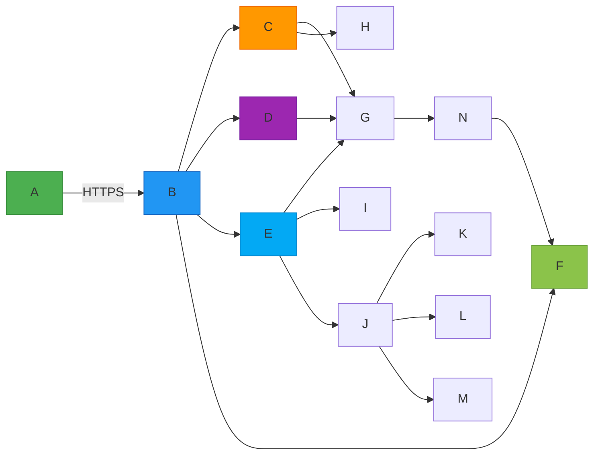

# 图书管理系统 系统架构文档

## 系统架构总览

- 采用分层微服务架构，划分为接入层、应用层、数据层与基础设施层；
- 前端为响应式Web应用（Vue 3 + TypeScript），支持PC端优先、兼容移动端浏览器；
- 后端基于Spring Boot 3.x构建模块化RESTful服务集群，各核心域（图书、用户、借阅）物理隔离、API网关统一鉴权路由；
- 数据层采用“主从分离+读写分离”策略：MySQL 8.0 主库（强一致性事务） + 从库（报表/检索查询）；Elasticsearch 8.x 承担全文检索与模糊匹配；
- 引入Redis 7.x作为分布式缓存与会话存储，支撑高并发借还操作与实时库存状态同步；
- 通过RabbitMQ实现异步解耦：逾期批处理、短信通知、日志归档等非核心路径均走消息队列；
- 全链路集成OpenTelemetry，支持trace_id透传与APM监控。

## 技术栈选型

- **前端框架**：Vue 3 + Pinia + Element Plus + Axios + PDFMake（PDF导出）；
- **后端框架**：Spring Boot 3.2 + Spring Security 6 + Spring Data JPA + Spring AMQP；
- **数据库**：
  - 关系型：MySQL 8.0（InnoDB引擎，GTID复制，主从延迟<100ms）；
  - 检索型：Elasticsearch 8.12（IK分词器，副本数=2，refresh_interval=30s）；
  - 缓存：Redis 7.2（Cluster模式，TTL策略：会话30min、库存状态5s、热点图书元数据10min）；
- **中间件**：RabbitMQ 3.13（镜像队列，持久化消息，死信重试机制）；
- **部署与运维**：
  - 容器化：Docker + Docker Compose（开发）、Kubernetes（生产，3节点集群）；
  - CI/CD：GitLab CI + Argo CD；
  - 监控告警：Prometheus + Grafana + Alertmanager（自定义QPS/错误率/DB连接池饱和度看板）；
- **安全组件**：JWT + OAuth2.0（资源服务器模式）、HMAC-SHA256签名验签、Jasypt加密敏感配置、Log4j2防日志注入。

## 模块划分与职责

- **图书管理模块（book-service）**：
  - 负责ISBN自动补全（调用国家新闻出版署OpenAPI）、索书号生成（《中图法》第五版规则）、分类树维护、馆藏位置动态映射；
  - 提供全文检索接口（ES聚合+高亮）、批量导入校验（Excel解析→字段清洗→事务回滚保障）；
- **用户管理模块（user-service）**：
  - 实现多角色注册流程（学生需学号+院系统一认证，教师对接LDAP，访客人工审核）；
  - 密码策略强制执行（zxcvbn强度评估）、手机号AES-GCM加密存储、自助重置含邮箱Token时效（15min）；
- **借阅管理模块（borrow-service）**：
  - 核心事务链：读者身份验证 → 图书状态校验（in_stock/reserved） → 库存扣减 → 借阅记录插入 → Redis库存原子更新；
  - 支持扫码快速办理（前端调用`/api/v1/borrows/scan`，后端解析ISBN/证号并联动多表校验）；
- **预约与逾期模块（async-service）**：
  - 独立调度服务：Quartz每日02:00触发逾期扫描（`SELECT ... FOR UPDATE SKIP LOCKED`防并发）；
  - 预约队列使用Redis Sorted Set（score=申请时间戳），到书时ZREVRANGE取首条并推送；
- **统计与报表模块（report-service）**：
  - 基于MySQL从库只读查询，预计算+物化视图（每月1日生成月度汇总表）；
  - 图表渲染交由前端ECharts，后端仅提供JSON数据源（支持分页/维度下钻）；
- **系统管理模块（admin-service）**：
  - 权限模型基于RBAC+ABAC混合策略：角色绑定菜单/API权限，同时支持“教师仅可查看本院图书”等属性规则；
  - 操作日志全量落库（含请求body脱敏后的关键字段），支持按IP/操作类型/时间范围检索。

## 接口定义（RESTful）

| 接口路径 | 请求方法 | 请求参数 | 响应参数 | 接口描述 |
|----------|----------|----------|----------|----------|
| `/api/v1/books` | POST | `` | `` | 新书入库：自动补全元数据、生成索书号、状态设为在馆 |
| `/api/v1/users/login` | POST | `` | `}` | 读者登录：返回JWT令牌及基础用户信息，密码经BCrypt比对 |
| `/api/v1/borrows` | POST | `` | `],"remaining_quota":3}` | 借书操作：校验用户借阅限额（≤5册）、图书状态（in_stock）、生成借阅记录并更新库存 |
| `/api/v1/borrows/return` | PUT | `` | `` | 还书操作：更新借阅记录状态、释放库存、计算滞纳金（若逾期） |
| `/api/v1/books/search` | GET | `q=Java&category=TP312&page=1&size=20` | `]}` | 全文模糊检索：支持题名/作者/ISBN多字段联合搜索，返回分页结果与实时状态 |

## 数据库设计（核心表）

- **`books` 表（图书主表）**：
  - `book_id UUID PK`、`isbn VARCHAR(17) UK`、`title VARCHAR(200)`、`author VARCHAR(100)`、`publisher VARCHAR(100)`、`pub_year YEAR`、`category_id BIGINT FK`、`call_number VARCHAR(50)`、`location VARCHAR(100)`、`status ENUM`、`created_at DATETIME`、`updated_at DATETIME`；
- **`users` 表（用户主表）**：
  - `user_id UUID PK`、`card_no VARCHAR(20) UK`、`name VARCHAR(50)`、`role ENUM('student','teacher','visitor')`、`phone_encrypted TEXT`、`email_encrypted TEXT`、`password_hash VARCHAR(100)`、`status ENUM('active','locked','expired')`；
- **`borrow_records` 表（借阅记录）**：
  - `borrow_id VARCHAR(32) PK`（格式：br-YYYYMMDD-XXXXX）、`user_id UUID FK`、`book_id UUID FK`、`borrow_date DATE NOT NULL`、`due_date DATE NOT NULL`、`return_date DATE NULL`、`renewed BOOLEAN DEFAULT FALSE`、`fine_amount DECIMAL(6,2) DEFAULT 0.0`、`status ENUM('active','returned','overdue','lost')`；
- **`reservations` 表（预约记录）**：
  - `reservation_id BIGINT PK AUTO_INC`、`user_id UUID FK`、`book_id UUID FK`、`applied_at DATETIME`、`status ENUM('pending','notified','expired','cancelled')`、`notify_sent BOOLEAN DEFAULT FALSE`；
- **`categories` 表（分类体系）**：
  - `category_id BIGINT PK`、`code VARCHAR(10) UK`（如`TP312`）、`name VARCHAR(50)`、`parent_id BIGINT NULL`（支持多级分类树）；
- **索引优化**：
  - `books(isbn)`、`books(status, category_id)`、`borrow_records(user_id, status)`、`borrow_records(book_id, status)`、`reservations(book_id, status)`；
  - Elasticsearch索引`books_index`映射包含`title^3`、`author^2`、`isbn`字段，启用ngram分词。

## 部署架构

- **生产环境拓扑**：
  - 3台K8s Worker节点（8C16G ×3）：分别部署`book-svc`、`user-svc`、`borrow-svc`（各2副本）、`es-master`（3节点）、`redis-cluster`（3主3从）；
  - 1台独立MySQL主从集群（1主2从，均部署于高IO云盘实例）；
  - 1台RabbitMQ镜像集群（3节点，所有队列自动镜像）；
  - API网关与静态资源部署于Nginx Ingress Controller（启用HTTP/2、Brotli压缩、OCSP Stapling）；
- **灾备策略**：
  - MySQL：Binlog实时同步至异地灾备中心（阿里云RDS跨地域只读实例）；
  - Elasticsearch：快照策略（每日凌晨1:00至OSS，保留30天）；
  - 应用服务：Helm Chart版本化管理，RollingUpdate策略，就绪探针检测`/actuator/health/readiness`；
- **灰度发布**：
  - 基于Header `X-Canary: true`路由至新版本Pod；
  - 借阅核心链路（`/borrows`）禁止灰度，仅开放`/search`、`/reports`等非事务接口灰度。

## 性能/安全设计

- **性能保障措施**：
  - 借阅事务内使用`@Transactional(isolation = Isolation.REPEATABLE_READ)` + `SELECT ... FOR UPDATE`锁行，避免超借；
  - 图书检索走ES冷热分离：热数据（近3个月借阅图书）存SSD节点，冷数据存HDD节点；
  - Redis库存计数器采用`INCRBY`原子操作，配合Lua脚本校验“借前检查+借后更新”幂等性；
  - 前端资源CDN加速（阿里云DCDN），Lighthouse评分≥95；
- **安全加固方案**：
  - 所有API强制HTTPS，HSTS头设置`max-age=31536000; includeSubDomains`；
  - 敏感操作（密码修改、借阅确认、预约取消）二次验证：发送6位数字短信验证码（有效期5min，单IP限5次/小时）；
  - 输入过滤：统一使用Spring Security的`@SafeHtml`注解 + OWASP Java Encoder输出编码；
  - 隐私脱敏：日志中`phone_encrypted`、`email_encrypted`字段仅打印`***@***.com`，前端展示读者证号隐藏中间4位（`STU2023****`）；
  - 审计合规：操作日志留存180天，满足《网络安全等级保护2.0》三级要求。