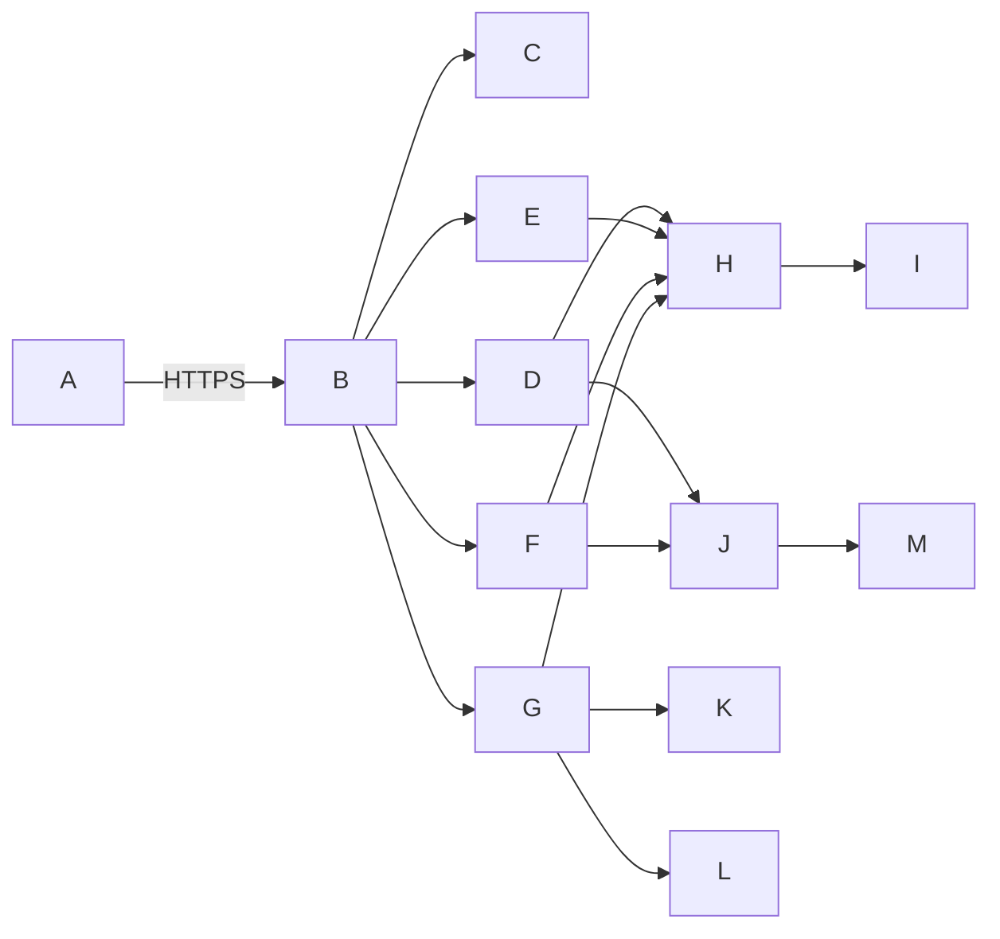

# 图书管理系统 系统架构文档

## 系统架构总览

- 采用前后端分离架构，后端提供 RESTful API，前端基于 Vue 3 + TypeScript 构建响应式 Web 应用；
- 整体为分层架构：表现层（Web/移动端适配）、API 网关层（JWT 鉴权 & 请求路由）、业务服务层（领域驱动模块化设计）、数据访问层（ORM + 原生 SQL 混合）、基础设施层（MySQL + Redis + SMTP + 文件存储）；
- 核心流程均通过领域事件解耦（如 `BookBorrowedEvent` 触发通知、库存更新、日志记录），保障事务一致性与可扩展性；
- 支持水平扩展关键组件（如借阅服务集群、通知服务队列），数据库主从读写分离，备份服务独立部署。

## 技术栈选型

- **后端框架**：Spring Boot 3.2（Java 17），集成 Spring Security、Spring Data JPA、Spring AMQP（RabbitMQ 备用）、Lombok、MapStruct；
- **数据库**：MySQL 8.0（主库，事务强一致） + Redis 7（缓存图书热点状态、用户会话、搜索结果页）；
- **文件存储**：MinIO（兼容 S3 协议）用于封面图上传，本地 fallback 存储路径 `/var/lib/bookms/uploads`；
- **消息与通知**：RabbitMQ（异步解耦通知任务），集成 JavaMailSender（SMTP over TLS） + WebSocket 实现实时站内信；
- **前端框架**：Vue 3（Composition API）、Pinia（状态管理）、Element Plus（UI 组件库）、ECharts（报表可视化）；
- **运维与监控**：Docker + Docker Compose（本地/测试环境），Prometheus + Grafana（指标采集），ELK（日志分析），Swagger UI（API 文档）；
- **安全合规**：BCryptPasswordEncoder（密码哈希）、JWT（无状态鉴权）、CORS 白名单控制、OWASP CSRFGuard（表单防重放）、SQL 注入/XSS 全链路过滤（MyBatis 参数绑定 + 前端 DOMPurify）。

## 模块划分与职责

- **图书核心模块（book-core）**：负责 `Book` 实体全生命周期管理；支持 ISBN 自动解析（调用公开元数据 API 如 OpenLibrary）、多级分类树维护、标签 CRUD、封面图上传与 CDN 转存；
- **用户权限模块（user-auth）**：实现 RBAC 模型（`ADMIN` / `READER`），含注册审核流（管理员后台审批）、密码强度策略（≥8位含大小写字母+数字）、登录失败锁定（5次后锁30分钟）、操作日志审计（Logback AOP 切面）；
- **借阅业务模块（borrow-flow）**：封装借/还/续/预约原子事务；状态机驱动 `Book.status` 变更（`in_stock ⇄ borrowed ⇄ reserved`），逾期自动标记（Quartz 定时任务每日 02:00 扫描）；
- **检索服务模块（search-service）**：基于 MySQL 全文索引（`title`, `author`, `isbn`, `category_path`）+ Redis 缓存热门关键词结果；支持拼音首字母模糊匹配（`pinyin4j` 预计算 `author_pinyin_initial` 字段）；
- **通知中心模块（notify-center）**：统一事件发布/订阅模型；接收 `BorrowSuccessEvent` 等事件，异步执行邮件发送（Thymeleaf 模板）+ WebSocket 推送 + 站内信落库；
- **报表统计模块（report-analytics）**：定时任务聚合 `borrow_record` 表生成宽表（`daily_borrow_summary`），供前端 ECharts 按维度（时间/分类/用户）拉取 JSON 数据；
- **系统基础模块（sys-base）**：提供通用配置中心（YAML 外部化）、备份服务（`mysqldump` + `rclone` 同步至阿里云 OSS）、健康检查端点（`/actuator/health`）。

## 接口定义（RESTful）

| 接口路径 | 请求方法 | 请求参数 | 响应参数 | 接口描述 |
|----------|----------|----------|----------|----------|
| `/api/v1/books` | POST | `` | `` | 新增图书，ISBN 格式校验与唯一性约束，封面图 URL 可选 |
| `/api/v1/books/search` | GET | `q=机器学习&author_pinyin=Y&isbn_prefix=978&category_ids=c002&limit=20&offset=0` | `]}` | 多条件模糊检索，支持关键词、作者拼音首字母、ISBN 前缀、分类 ID 数组 |
| `/api/v1/borrows` | POST | `` | `` | 用户借书，校验图书状态为 `in_stock`，自动设置 30 天应还日期，事务内更新 `Book.status` |
| `/api/v1/borrows//return` | PUT | — | `` | 归还图书，事务内更新 `BorrowRecord.status=returned` 与 `Book.status=in_stock`，计算是否逾期 |
| `/api/v1/users/me/borrows?status=active` | GET | `status=active \| returned \| overdue`（可选） | `,"due_date":"2024-06-20","status":"active"}]}` | 当前用户查询个人借阅记录，支持按状态筛选，敏感字段（如 user_id）服务端脱敏 |

## 数据库设计（核心表）

- **`book` 表**：`book_id`（PK, UUID）、`isbn`（UK, VARCHAR(17)）、`title`（NOT NULL）、`author`（VARCHAR(100)）、`category_path`（VARCHAR(255)，如 `computer/ai/ml`）、`status`（ENUM）、`location`（VARCHAR(50)）、`cover_url`（TEXT）、`created_at`、`updated_at`；
- **`user` 表**：`user_id`（PK, UUID）、`username`（UK）、`password_hash`（BCrypt）、`role`（ENUM: `ADMIN`/`READER`）、`status`（ENUM: `pending`/`active`/`disabled`）、`email`（UK, NOT NULL）、`real_name`、`created_at`；
- **`borrow_record` 表**：`borrow_id`（PK, UUID）、`book_id`（FK）、`user_id`（FK）、`borrow_date`（DATE）、`due_date`（DATE）、`return_date`（NULLABLE）、`status`（ENUM: `active`/`returned`/`overdue`/`cancelled`）、`created_at`；
- **`category` 表**：`category_id`（PK）、`name`（NOT NULL）、`parent_id`（FK self-reference）、`level`（TINYINT）、`path`（VARCHAR(255)，如 `/computer/ai/`）；
- **`notification` 表**：`notify_id`（PK）、`user_id`（FK）、`type`（ENUM: `borrow_success`/`overdue_reminder`/`reserve_ready`）、`content`（JSON，含模板变量）、`read_status`（TINYINT）、`sent_at`（NULLABLE）；
- **索引优化**：`book(isbn)` UK、`book(title, author)` FULLTEXT、`borrow_record(user_id, status)`、`borrow_record(book_id, status)`、`category(path)`。

## 部署架构

- **生产环境**：3 节点高可用集群（Nginx + Spring Boot + MySQL 主从 + Redis Sentinel）；
  - Nginx 层：SSL 终止、负载均衡（加权轮询）、静态资源托管（`/assets`）、限流（`limit_req` 每 IP 100r/m）；
  - 应用层：每个节点运行 `bookms-app.jar`，JVM 参数 `-Xms512m -Xmx1g -XX:+UseG1GC`，Actuator 端点启用 `/health` `/metrics` `/loggers`；
  - 数据层：MySQL 主库（写）+ 2 从库（读），GTID 复制；Redis 3 节点哨兵模式（1 主 2 从），`maxmemory=2g` + `allkeys-lru`；
  - 存储层：MinIO 4 节点分布式集群（纠删码 EC:4），备份脚本每日 02:00 执行 `mysqldump --single-transaction` + `rclone sync /var/lib/mysql/ oss:bookms-backup/$(date +%Y%m%d)`；
- **CI/CD 流程**：GitLab CI 触发 → Maven 编译/单元测试 → SonarQube 扫描 → 构建 Docker 镜像 → Helm 部署至 Kubernetes（测试环境）或 Ansible（生产物理机）；
- **灾备方案**：RPO < 5min（Binlog 实时同步），RTO < 15min（Ansible 自动拉起备用实例 + DNS 切换）。

## 性能/安全设计

- **性能保障**：
  - 检索优化：`book.title` 和 `book.author` 建立复合全文索引；高频查询（如首页新书）结果缓存至 Redis（TTL=300s）；分页采用游标式（`last_book_id`）替代 `OFFSET`；
  - 并发控制：借还书接口加分布式锁（Redisson `RLock`，Key=`lock:borrow:$`），超时 10s，避免库存超卖；
  - 静态资源：Webpack 构建产物启用 Gzip/Brotli 压缩，CDN 分发（Cloudflare）；
- **安全加固**：
  - 认证鉴权：JWT Token 存于 HttpOnly Cookie（`SameSite=Lax`），有效期 2h，Refresh Token 存 Redis（TTL=7d）；
  - 敏感操作审计：删除图书需 `POST /api/v1/books//audit-delete` 提交审批申请，管理员在 `/admin/approvals` 页面二次确认并留痕；
  - 输入防护：全局 `@Valid` 校验（ISBN 正则 `^d$|^d$`）、MyBatis `#` 防注入、前端富文本输入经 DOMPurify 过滤；
  - 合规性：日志脱敏（手机号 `138****1234`、邮箱 `u***@example.com`），备份加密（AES-256-GCM），通过 OWASP ZAP 扫描（报告留存于 Nexus Repository）。