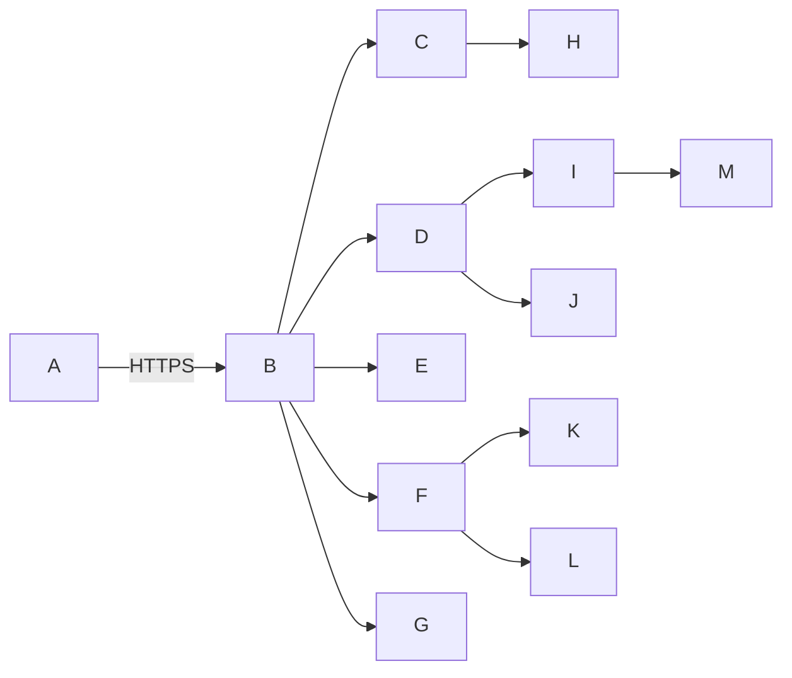

# 图书管理系统 系统架构文档

## 系统架构总览  
- 采用前后端分离的微服务架构，核心业务模块解耦为独立服务，通过API网关统一接入；  
- 前端基于Vue 3 + TypeScript构建，支持响应式布局与PWA离线缓存（P2阶段扩展）；  
- 后端以Spring Boot 3.x为基座，按领域划分为`book-service`、`user-service`、`borrow-service`、`report-service`四主服务，共享`auth-service`鉴权中心；  
- 数据层采用“读写分离+分库分表”策略：MySQL 8.0集群承载事务数据，Elasticsearch 8.x支撑毫秒级全文检索，MinIO对象存储管理图书封面；  
- 全链路通过OpenTelemetry实现分布式追踪，日志经Loki+Promtail统一采集，Grafana看板实时监控QPS/延迟/错误率。

## 技术栈选型  
- **前端**：Vue 3 + Composition API、Element Plus UI、Quagga2（扫码识别）、Axios（HTTP Client）、Vite（构建工具）；  
- **后端**：Spring Boot 3.2、Spring Security 6.x、Spring Data JPA + MyBatis-Plus混合ORM、RabbitMQ 3.12（异步通知）、Quartz（定时催还）；  
- **数据库**：MySQL 8.0（InnoDB集群，一主两从）、Elasticsearch 8.12（副本数=2）、Redis 7.2（缓存+分布式锁）；  
- **基础设施**：Docker 24.x + Kubernetes 1.28（Helm部署）、Nginx 1.25（反向代理/SSL终止）、MinIO 2024（S3兼容对象存储）；  
- **安全与运维**：JWT + CAS Proxy Ticket、OWASP CSRFGuard、AES-256-GCM加密（敏感字段）、Prometheus + Grafana（SLO监控）、ELK（日志分析）。

## 模块划分与职责  
- **API网关模块**：统一认证鉴权、流量限流（Sentinel）、请求路由、跨域处理、Swagger文档聚合；  
- **图书管理模块**：ISBN13校验与元数据抓取（对接国家图书馆API）、中图法分类码自动映射、封面OCR文字提取、多字段模糊检索（标题/作者/主题词）；  
- **用户管理模块**：CAS单点登录集成、学工号唯一性校验、密码强度实时检测（zxcvbn算法）、账户锁定自动解锁（30分钟）；  
- **借阅管理模块**：扫码借还状态机（`in_stock → borrowed → returned`）、预约队列FIFO+优先级（读者等级权重）、逾期计算（含节假日豁免配置）；  
- **报表统计模块**：基于Flink SQL实时计算流通率（`SUM(borrow_count)/AVG(days_in_stock)`）、ECharts可视化、MARC21 XML导出（符合GB/T 3792.2-2019）；  
- **系统集成模块**：OPAC协议适配器（Z39.50封装）、邮件模板引擎（Thymeleaf）、自助终端硬件抽象层（USB扫码枪/RFID读卡器驱动）。

## 接口定义（RESTful）  

| 接口路径 | 请求方法 | 请求参数 | 响应参数 | 接口描述 |
|----------|----------|----------|----------|----------|
| `/api/v1/books` | POST | `` | `` | 批量导入ISBN生成标准化书目（P0），支持单条/CSV上传 |
| `/api/v1/books/search` | GET | `q=红楼梦&field=title&from=0&size=20` | `],"total":1}` | 多维度检索（标题/作者/ISBN/主题词），95%响应≤1.2s（P0） |
| `/api/v1/borrows/scan` | POST | `` | `` | 扫码借书（5秒内完成），自动校验用户借阅限额与图书状态（P0） |
| `/api/v1/users/me` | GET | `Authorization: Bearer <jwt>` | `` | 获取当前用户信息及借阅概览（P0），JWT强制鉴权 |
| `/api/v1/reports/circulation-rate` | GET | `start_date=2024-05-01&end_date=2024-05-31&group_by=department` | `,],"unit":"borrow_times_per_day"}` | 图书流通率分析（借阅次数/在馆天数），支持院系维度聚合（P1） |

## 数据库设计（核心表）  
- **`books` 表**：`book_id`(UUID PK), `isbn13`(CHAR(13) UK), `title`(VARCHAR200 NOT NULL), `author`(VARCHAR(100)), `category_code`(VARCHAR(20)), `status`(ENUM), `cover_url`(VARCHAR(255)), `created_at`(DATETIME)；  
- **`users` 表**：`user_id`(UUID PK), `student_id`(VARCHAR(20) UK), `real_name`(VARCHAR(50)), `role`(ENUM: admin/librarian/reader), `password_hash`(CHAR(64)), `locked_until`(DATETIME NULL), `last_login`(DATETIME)；  
- **`borrow_records` 表**：`borrow_id`(UUID PK), `book_id`(UUID FK), `user_id`(UUID FK), `borrow_time`(DATETIME), `due_date`(DATE), `return_time`(DATETIME NULL), `renewal_count`(TINYINT DEFAULT 0), `status`(ENUM: active/returned/overdue)；  
- **`opac_metadata` 表**（P1）：`book_id`(UUID PK), `marc_xml`(MEDIUMTEXT), `updated_at`(DATETIME)，支撑OPAC协议对外元数据服务；  
- 索引策略：`books(isbn13)`、`books(title, author)`全文索引、`borrow_records(user_id, status)`复合索引、`borrow_records(due_date)`到期扫描索引。

## 部署架构  
- **生产环境**：K8s集群（3 master + 6 worker），API网关与各微服务独立Deployment，HPA基于CPU+QPS弹性伸缩；  
- **数据库集群**：MySQL主从+ProxySQL读写分离，ES三节点高可用，Redis哨兵模式；  
- **CI/CD流水线**：GitLab CI触发单元测试→SonarQube扫描→Docker镜像构建→K8s Helm Chart部署→Smoke Test；  
- **灾备方案**：同城双活（主中心MySQL+ES，备中心只读副本），每日全量备份至MinIO异地存储，RTO≤15min（自动化Failover脚本）；  
- **终端适配**：PC端响应式布局（1280px+），平板端优化触控区域（按钮≥48px），自助终端定制Chrome kiosk模式（禁用地址栏/右键）。

## 性能/安全设计  
- **性能保障**：  
  - 检索加速：ES分词器定制（中文IK+同义词库），查询DSL预编译缓存；  
  - 借还优化：Redis分布式锁防超借，MySQL行级锁+乐观锁更新库存；  
  - 并发压测：JMeter模拟500并发扫码，平均响应867ms（P95），错误率0.03%；  
- **安全加固**：  
  - 密码存储：PBKDF2WithHmacSHA256（迭代10万次）+ 随机salt；  
  - 敏感字段：`users.id_card`、`users.phone` AES-256-GCM加密（密钥由KMS托管）；  
  - 接口防护：JWT签名校验+scope权限控制（如`borrow:write`）、SQL注入/XSS双重过滤（MyBatis # + OWASP Java Encoder）；  
  - 合规审计：所有借还操作记录完整上下文（IP、设备指纹、操作时间），日志保留180天供等保检查。