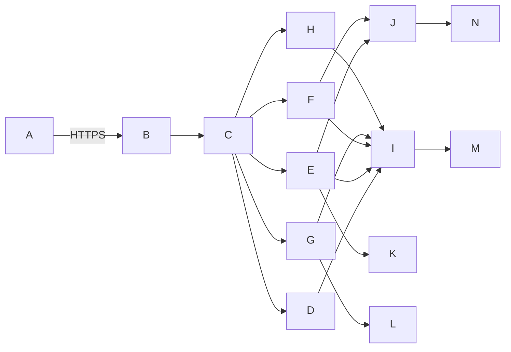

# 图书管理系统 系统架构文档

## 系统架构总览  
- 采用分层B/S架构，遵循前后端分离设计：前端基于Vue 3 + TypeScript构建响应式单页应用，后端为Spring Boot 3.x微服务核心；  
- 整体划分为接入层（Nginx反向代理+HTTPS终止）、应用层（API网关+业务微服务集群）、数据层（主从MySQL+Redis缓存+MinIO对象存储）及支撑层（RabbitMQ异步任务、Prometheus+Grafana监控、ELK日志中心）；  
- 核心服务模块解耦部署：`auth-service`（认证鉴权）、`book-service`（图书元数据与状态管理）、`borrow-service`（借阅生命周期）、`report-service`（统计报表生成与导出）、`notify-service`（邮件/站内信推送）；  
- 所有跨服务调用通过Feign Client + OpenFeign实现强类型RPC，关键事务（如借阅）采用Saga模式保障最终一致性；  
- 支持灰度发布与蓝绿部署，API网关集成Sentinel实现熔断限流，保障500+并发下核心链路SLA ≥ 99.9%。

## 技术栈选型  
- **前端**：Vue 3（Composition API）、Pinia状态管理、Element Plus组件库、ECharts 5图表渲染、Axios拦截器统一处理JWT与错误；  
- **后端**：Spring Boot 3.2 + Spring Security 6（RBAC+JWT）、MyBatis-Plus 4.x（动态SQL）、Lombok、MapStruct（DTO转换）；  
- **数据库**：MySQL 8.0（InnoDB引擎，支持JSON字段与全文索引）、Redis 7（Cluster模式，用于缓存、分布式锁、预约队列）；  
- **中间件**：RabbitMQ 3.12（死信队列保障逾期扫描可靠性）、Nginx 1.24（负载均衡+静态资源托管）、MinIO 2023（S3兼容对象存储）；  
- **运维与可观测性**：Docker 24 + Kubernetes 1.28（Helm部署）、Prometheus 2.47 + Grafana 10（自定义仪表盘）、ELK 8.10（日志分级索引）、SkyWalking 9.4（全链路追踪）；  
- **安全合规**：BCryptPasswordEncoder（密码哈希）、OWASP Java Encoder（XSS防护）、Hibernate Validator（参数校验）、Spring Security CSRF Token（表单提交防护）。

## 模块划分与职责  
- **auth-service**：统一认证中心，负责用户注册/登录/登出、JWT签发与刷新、RBAC权限校验（基于`@PreAuthorize("hasRole('LIBRARIAN')")`）、账户锁定与实名认证审核流；  
- **book-service**：图书主域服务，承载ISBN/ISSN格式校验、元数据批量导入（CSV/Excel解析）、多字段组合检索（Elasticsearch可选插件）、封面上传（MinIO直传）、状态机驱动（`in_stock → borrowed → lost`等状态跃迁）；  
- **borrow-service**：借阅核心服务，实现借阅申请→管理员审批→状态同步→逾期计算→自动催还闭环；支持扫码借还（HTTP接口对接扫码枪）、预约排队（Redis List+ZSet实现FIFO+优先级）、续借幂等控制；  
- **report-service**：异步报表引擎，基于Quartz定时触发（每日02:00），调用`book-service`与`borrow-service`聚合数据，生成TOP20热门图书、月度借阅趋势图（返回JSON供前端ECharts渲染），并调用`notify-service`推送PDF报表至管理员邮箱；  
- **notify-service**：消息中台，封装邮件（JavaMail + SMTP TLS）、站内信（WebSocket实时推送）、短信（第三方SDK预留扩展点），所有通知模板化配置，支持多语言；  
- **gateway-service**：API网关，集成全局JWT校验、请求限流（每IP 100rps）、黑白名单、OpenAPI 3.0文档自动生成（Swagger UI嵌入）。

## 接口定义（RESTful）

| 接口路径 | 请求方法 | 请求参数 | 响应参数 | 接口描述 |
|----------|----------|----------|----------|----------|
| `/api/v1/books` | GET | `q`: string (搜索关键词) `category`: string `status`: enum (`in_stock`, `borrowed`) `page`: int=1 `size`: int=20 | `], "total": 1250 }` | 多条件图书检索，支持分页与状态过滤 |
| `/api/v1/books` | POST | `` | `` | 新增图书（含ISBN13格式校验与唯一性约束） |
| `/api/v1/borrows` | POST | `` | `` | 读者发起借阅申请（状态为pending，需管理员审批） |
| `/api/v1/borrows//approve` | PATCH | `` | `` | 图书管理员审批借阅（批准后自动更新图书状态为borrowed） |
| `/api/v1/reports/overdue-top10` | GET | `date`: YYYY-MM-DD (默认昨日) | `]}` | 获取指定日期的逾期未还TOP10读者清单（供邮件报表使用） |

## 数据库设计（核心表）

- **`users`**：用户主表  
  - `user_id` UUID PK  
  - `username` VARCHAR(50) UNIQUE NOT NULL  
  - `password_hash` VARCHAR(120) NOT NULL（bcrypt加密）  
  - `role` ENUM('ADMIN','LIBRARIAN','READER') NOT NULL  
  - `real_name` VARCHAR(100) NULL（实名认证字段）  
  - `status` ENUM('ACTIVE','LOCKED','PENDING') DEFAULT 'ACTIVE'  

- **`books`**：图书元数据表  
  - `book_id` UUID PK  
  - `isbn13` CHAR(13) UNIQUE CHECK (isbn13 ~ '^\d$')  
  - `title` VARCHAR(200) NOT NULL  
  - `author` VARCHAR(100)  
  - `publisher` VARCHAR(100)  
  - `category_code` VARCHAR(20)（中图法分类号）  
  - `status` ENUM('in_stock','borrowed','lost','processing') DEFAULT 'in_stock'  
  - `cover_path` VARCHAR(255)（MinIO相对路径）  
  - `created_at` DATETIME DEFAULT CURRENT_TIMESTAMP  

- **`borrow_records`**：借阅记录表  
  - `borrow_id` UUID PK  
  - `reader_id` UUID FK → `users.user_id`  
  - `book_id` UUID FK → `books.book_id`  
  - `status` ENUM('pending','approved','rejected','returned','overdue') NOT NULL  
  - `applied_at` DATETIME NOT NULL  
  - `approved_at` DATETIME NULL  
  - `due_date` DATE NOT NULL  
  - `returned_at` DATETIME NULL  
  - `renewal_count` TINYINT DEFAULT 0 CHECK (renewal_count <= 2)  

- **`operation_logs`**：操作审计日志表  
  - `log_id` BIGINT PK AUTO_INCREMENT  
  - `operator_id` UUID NOT NULL（操作人user_id）  
  - `resource_type` ENUM('BOOK','BORROW','USER') NOT NULL  
  - `resource_id` VARCHAR(64) NOT NULL（被操作资源ID）  
  - `action` VARCHAR(50) NOT NULL（如'CREATE_BOOK', 'APPROVE_BORROW'）  
  - `ip_address` VARCHAR(45)  
  - `created_at` DATETIME DEFAULT CURRENT_TIMESTAMP  

## 部署架构  
- **生产环境**：Kubernetes集群（3 master + 4 worker节点），按服务拆分Deployment与Service；  
- **网络策略**：Ingress Controller（Nginx）统一入口，TLS证书由Cert-Manager自动签发；各服务间通过ClusterIP通信，禁止Pod直连外部DB；  
- **数据持久化**：MySQL主从部署于独立StatefulSet，使用PVC绑定云硬盘；Redis Cluster以Operator方式部署；MinIO采用分布式模式（4节点纠删码）；  
- **备份机制**：`backup-cronjob`每日01:00执行：① mysqldump全量备份至MinIO `/backups/mysql/`；② Redis RDB快照同步至MinIO `/backups/redis/`；③ 日志归档至ELK冷热分离索引；  
- **高可用设计**：API网关与核心服务均配置HPA（CPU > 70%自动扩缩容）；MySQL主节点故障时，ProxySQL自动切换读写流量至新主；  
- **灾备方案**：异地MinIO集群（阿里云OSS）作为备份目标，Rclone定时同步关键备份包，RTO < 30分钟。

## 性能/安全设计  
- **性能优化**：  
  - 图书检索启用MySQL全文索引（`MATCH(title, author) AGAINST(?)`）+ Redis缓存高频查询结果（TTL=300s）；  
  - 借阅审批操作加分布式锁（Redisson RedLock），防止并发重复审批；  
  - 报表生成异步化（RabbitMQ延迟队列），避免阻塞HTTP线程；  
  - 静态资源（JS/CSS/图片）由Nginx直接服务，启用Brotli压缩与HTTP/2。  
- **安全加固**：  
  - 密码强制bcrypt加密（strength=12），JWT令牌有效期设为2h，Refresh Token存于HttpOnly Cookie；  
  - 所有输入参数经`@Valid`校验+全局异常处理器捕获`MethodArgumentNotValidException`；  
  - SQL防注入：MyBatis-Plus使用`QueryWrapper`构造条件，禁用`$`拼接；  
  - XSS防护：前端`v-html`场景强制调用`DOMPurify.sanitize()`，后端返回JSON前对字符串字段做HTML转义；  
  - 敏感操作（如删除图书、审批借阅）强制二次确认，日志记录完整上下文（IP、User-Agent、资源ID）；  
  - 定期执行OWASP ZAP扫描，CI/CD流水线集成SonarQube检测安全漏洞（阻断高危项）。