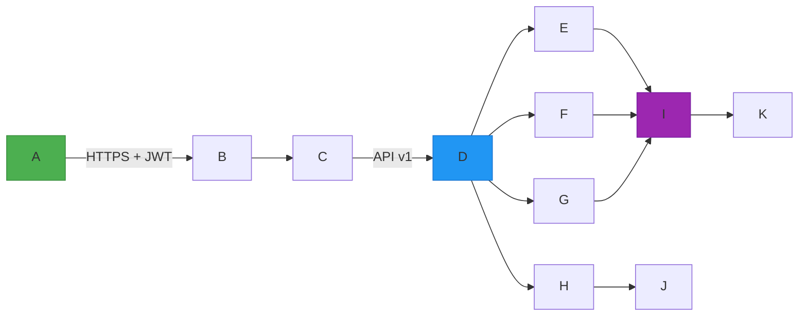

# 用户管理系统 系统架构文档

## 系统架构总览

- 采用前后端分离架构，前端基于 Vue 3 + TypeScript + Element Plus 构建响应式管理界面；后端为 Spring Boot 3.x 微服务架构，遵循 Clean Architecture 分层设计（Controller → Service → Domain → Infrastructure）；
- 核心模块解耦部署：用户中心（User Center）、权限中心（Auth Center）、组织中心（Org Center）、审计中心（Audit Center），通过 RESTful API + 内部 gRPC 调用协同；
- 全链路 HTTPS + JWT + RBAC + 双因素认证（敏感操作）保障安全边界；
- 整体架构支持水平扩展，关键服务（如用户查询、登录鉴权）支持多实例无状态部署。

## 技术栈选型

- **前端**：Vue 3（Composition API）、TypeScript 5.x、Pinia 状态管理、Axios 封装拦截器（自动注入 JWT、脱敏处理）、ECharts 5（未来扩展看板预留）；
- **后端**：Spring Boot 3.2 + Spring Security 6.x（JWT + OAuth2 Resource Server）、MyBatis-Plus 3.5、Redis 7.x（会话缓存、登录失败计数、短信验证码）、RabbitMQ（异步审计日志写入）；
- **数据库**：MySQL 8.0（InnoDB，主从读写分离），字符集 utf8mb4_bin；敏感字段（phone/email/id_card）加密存储（AES-GCM）+ 应用层脱敏；
- **基础设施**：Docker 24.x + Docker Compose 2.20，Nginx 1.24 作反向代理与 HTTPS 终结，Certbot 自动续签 TLS 证书；
- **监控告警**：Prometheus + Grafana（QPS/错误率/响应延迟），ELK（Elasticsearch + Logstash + Kibana）聚合审计日志；
- **安全合规**：ShiroFilter 替换为 Spring Security 6 的 `HttpSecurity` 配置，满足等保2.0“身份鉴别、访问控制、安全审计、剩余信息保护”要求。

## 模块划分与职责

- **用户服务模块（User Service）**：承载用户全生命周期操作（CRUD、状态变更、密码重置、实名认证），校验手机号/邮箱唯一性，集成短信网关（阿里云SMS）触发双因子验证；
- **角色权限模块（RBAC Service）**：实现角色定义、菜单/按钮级权限绑定、用户-角色关联（UserRole）、权限动态加载（前端路由守卫依据 `/api/v1/permissions/me` 返回结果渲染）；
- **组织架构模块（Org Service）**：维护部门树（递归闭包表设计）、岗位信息、汇报关系（manager_id 字段），支持拖拽调整层级并自动生成路径编码（如 `0001.0002.0003`）；
- **审计日志模块（Audit Service）**：统一拦截 `@LogOperation` 注解方法，异步推送日志至 RabbitMQ，由 Log Consumer 写入 Elasticsearch 并同步备份至 MySQL 归档表；
- **认证授权模块（Auth Service）**：独立提供 `/auth/login`、`/auth/refresh` 接口，JWT payload 包含 `user_id`, `roles`, `perms`, `exp`，Redis 存储活跃 token 黑名单（登出/踢出）；
- **文件与配置模块（File & Config Service）**：托管 Excel 导入模板、导出结果文件（MinIO），提供动态配置中心（Nacos 2.3）管理密码策略、锁定阈值等运行时参数。

## 接口定义（RESTful）

| 接口路径 | 请求方法 | 请求参数 | 响应参数 | 接口描述 |
|----------|----------|----------|----------|----------|
| `/api/v1/users` | POST | `` | ` }` | 创建用户（P0），自动校验唯一性、触发入职流程事件 |
| `/api/v1/users//status` | PATCH | ``（0=禁用，2=离职） | ` }` | 修改用户状态（P0），离职时自动回收所有角色权限并通知审计中心 |
| `/api/v1/roles//permissions` | PUT | `` | ` }` | 绑定角色权限（P0），支持菜单级与按钮级细粒度控制 |
| `/api/v1/departments/tree` | GET | `?include_disabled=false` | `] }` | 获取组织架构树（P0），返回扁平化+嵌套混合结构，支持按状态过滤 |
| `/api/v1/audit/logs` | GET | `?start_time=2024-06-01T00:00:00Z&end_time=2024-06-02T00:00:00Z&operator_id=U123&limit=20&offset=0` | `] }` | 查询审计日志（P0），支持多维筛选与分页，敏感字段已脱敏 |

## 数据库设计（核心表）

- **`users` 表**：存储用户基础信息；`phone`/`email` 字段 AES-GCM 加密；`status` 枚举值（0=禁用，1=启用，2=离职）；索引：`idx_phone_encrypted`, `idx_email_encrypted`, `idx_dept_status`；
- **`roles` 表**：预置角色（super_admin、dept_leader、normal_user）+ 自定义角色；`code` 唯一（如 `dept_leader`），用于前端权限判断；
- **`permissions` 表**：`perm_code`（如 `user:import`）、`name`（中文名）、`type`（MENU/BUTTON/API）、`path`（前端路由或接口路径）；
- **`user_roles` 表**：联合主键 `(user_id, role_id)`，逻辑删除标记 `is_deleted`，避免硬删除影响审计追溯；
- **`departments` 表**：采用闭包表（`department_closure`）+ 邻接表（`parent_id`）双模型，支持高效子树查询与层级移动；`path` 字段存储路径编码（如 `'0001.0002.0003'`）；
- **`audit_logs` 表**：仅存元数据（操作人、IP、时间、动作码、目标ID）；完整详情异步写入 Elasticsearch，MySQL 仅保留 90 天归档；
- **`login_attempts` 表**（Redis 替代）：实际使用 Redis Hash 存储 `login_fail:` 计数 + TTL，避免 DB 写入瓶颈。

## 部署架构

- **生产环境**：3 节点高可用集群（Nginx + API Gateway + User Service + RBAC Service + Org Service + Auth Service），MySQL 主从（1主2从）+ Redis Sentinel（3节点）+ Elasticsearch 3节点集群 + MinIO 4节点分布式；
- **CI/CD 流程**：GitLab CI 触发构建 → 单元测试/安全扫描（SonarQube）→ 构建多平台 Docker 镜像 → 推送 Harbor → Ansible 执行 Docker Compose 部署（蓝绿发布）；
- **灾备策略**：MySQL Binlog 实时同步至异地机房从库；Elasticsearch 快照自动上传至 AWS S3；每日凌晨 2:00 执行 `mysqldump` 全量备份 + `xtrabackup` 增量备份，保留 7 天本地 + 30 天对象存储；
- **容器编排**：`docker-compose.prod.yml` 定义服务依赖、健康检查（`curl -f http://localhost:8080/actuator/health`）、资源限制（CPU 2C / MEM 2G per service）；
- **域名与证书**：`um.company.com`（主站），`api.um.company.com`（API），全部强制 HTTPS 301 跳转，TLS 1.3 启用，HSTS 头设置 max-age=31536000。

## 性能/安全设计

- **性能优化**：
  - 用户列表分页查询使用 `LIMIT OFFSET` + 覆盖索引（`idx_status_dept_created`）；
  - 部门树首次加载缓存至 Redis（TTL=1h），变更时主动失效；
  - JWT 解析使用 `Jwts.parserBuilder().setSigningKey(...).build()` 预编译，避免每次新建解析器；
  - 批量导入采用 `EasyExcel` 异步流式读取 + 分批事务提交（每 100 条 commit 一次）；
- **安全加固**：
  - 所有 Controller 方法添加 `@PreAuthorize("hasPermission(#user_id, 'user:update')")` 注解，结合 `PermissionEvaluator` 实现数据级权限（如部门主管仅可操作本部门用户）；
  - 密码字段强制 `@NotBlank @Size(min=8) @Pattern(regexp="(?=.*)(?=.*)(?=.*d)")` 校验，存储前经 `BCryptPasswordEncoder.encode()` 处理；
  - 敏感接口（`DELETE /users/`）前置拦截器校验 `X-Verify-Code` 请求头（短信验证码 SHA256(token+code)），且 5 分钟内单 IP 限频 3 次；
  - SQL 参数化 + MyBatis `#` 占位符杜绝注入；前端输入框统一 `v-model.trim` + XSS 过滤（DOMPurify）；
  - 登录失败锁定：Redis 中 `INCR login_fail:`，`EXPIRE` 30 分钟，达阈值 5 次后 `SETNX lock: 1` 并设 TTL；
- **合规保障**：
  - 审计日志不可篡改：Elasticsearch 索引 `settings.index.blocks.write: true` 锁定只读；
  - 个人信息脱敏：后端返回 JSON 前经 `@JsonSerialize(using = PhoneMaskSerializer.class)` 处理；
  - 等保2.0落地：日志留存 ≥180 天（ES + 备份）、通信传输加密（TLS 1.3）、身份鉴别（JWT+短信双因子）、访问控制（RBAC+数据行级）。