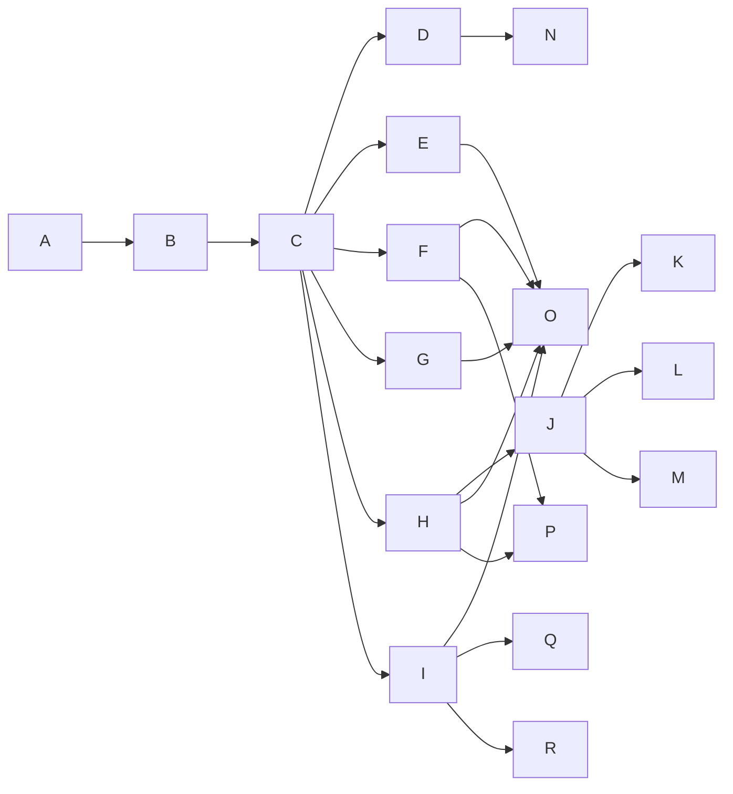

# 购物系统 系统架构文档

## 系统架构总览  
- 采用分层微服务架构，划分为接入层、应用层、服务层、数据层与基础设施层；  
- 前端统一通过 API Gateway（Kong）路由至后端服务，支持多终端适配（PC/Web/小程序）；  
- 核心业务模块（用户、商品、订单、购物车）拆分为独立服务，通过 gRPC + REST 混合通信；  
- 引入事件驱动机制：库存变更、订单状态更新等关键操作发布至 Kafka，由库存服务、物流服务、消息中心等异步消费；  
- 全链路灰度能力：基于请求 Header 中 `x-deployment-id` 实现流量染色与分流，支持按用户 ID 或店铺 ID 精准灰度；  
- 架构图如下：

## 技术栈选型  
- **前端**：Vue 3 + TypeScript + Pinia + Vant（小程序）/ Element Plus（PC后台）；  
- **网关与中间件**：Kong（API路由/限流/鉴权）、Kafka（事件总线）、Redis Cluster（分布式锁/缓存/会话）、Elasticsearch（全文检索）；  
- **后端语言与框架**：Java 17 + Spring Boot 3.x + Spring Cloud Alibaba（Nacos注册中心 + Seata分布式事务）；  
- **数据库**：MySQL 8.0（分库分表：`user_db`/`order_db`/`product_db`），TiDB 预留用于秒杀场景扩展；  
- **支付对接**：微信支付 v3 API（证书双向认证）、支付宝开放平台（RSA2签名）；  
- **部署与运维**：Docker + Kubernetes（Helm Chart 管理）、Argo CD（GitOps交付）、OpenTelemetry（链路追踪）；  
- **安全合规**：Spring Security OAuth2 Resource Server、JWT 自动续期、敏感字段 AES-GCM 加密落库（如银行卡号、身份证号）。

## 模块划分与职责  
- **Auth Module**：负责手机号/微信一键登录、JWT签发与校验、短信验证码生成与核验、密码重置；  
- **User Module**：管理用户资料、收货地址 CRUD、收藏夹同步、浏览历史记录（写入 Redis + 异步落库）；  
- **Product Module**：支持多级类目树、SKU规格矩阵管理、图文富文本详情（Tiptap 编辑器）、评价审核流（运营后台介入）；  
- **Cart Module**：基于用户 ID 的 Redis Hash 存储购物车项，实时调用 Inventory Service 校验库存，失效商品自动标记；  
- **Order Module**：实现幂等下单（`order_no` 全局唯一索引 + 分布式锁）、优惠券/满减规则引擎（Drools 集成）、状态机驱动（Spring Statemachine）、支付结果异步回调防重处理；  
- **Admin Module**：RBAC 权限模型（`role → permission → menu/api` 三级映射），销售看板（ECharts + 后端聚合 SQL），Excel 导出使用 Apache POI SXSSF 流式生成；  
- **System Module**：统一消息中心（站内信 + 微信模板消息 ID 绑定）、操作日志切面（@LogAudit 注解 + JSON Diff 记录变更）、短信网关（阿里云 SMS SDK 封装）。

## 接口定义（RESTful）

| 接口路径 | 请求方法 | 请求参数 | 响应参数 | 接口描述 |
|----------|----------|----------|----------|----------|
| `/api/v1/auth/login` | POST | `` | `` | 手机号+短信验证码登录，返回 JWT Token |
| `/api/v1/products/search` | GET | `q=手机&category_id=102&sort=price_asc&page=1&size=20` | `], "total": 124 }` | 商品关键词搜索，支持分类过滤与排序 |
| `/api/v1/carts` | POST | `` | `` | 添加商品至购物车，自动校验库存并返回最新摘要 |
| `/api/v1/orders` | POST | `` | `` | 创建订单并获取微信支付链接，含超时时间 |
| `/api/v1/orders//status` | GET | — | ` }` | 查询单个订单状态及物流信息，支持 Webhook 回调订阅 |

## 数据库设计（核心表）

- **`user` 表**：`user_id`(PK), `username`, `password_hash`, `phone`, `avatar_url`, `created_at`, `updated_at`；  
- **`product_sku` 表**：`sku_id`(PK), `spu_id`, `spec_json`（JSON，如 ``）, `price`, `stock_quantity`, `status`(TINYINT)；  
- **`shopping_cart` 表**：`id`(PK), `user_id`, `sku_id`, `quantity`, `created_at`, `updated_at`，逻辑删除标记 `is_deleted`；  
- **`order_header` 表**：`order_no`(PK), `user_id`, `address_id`, `total_amount`, `discount_amount`, `pay_status`(TINYINT), `created_at`, `paid_at`, `closed_reason`；  
- **`order_item` 表**：`id`(PK), `order_no`, `sku_id`, `quantity`, `unit_price`, `snapshot_spec`（快照规格 JSON）；  
- **`admin_log` 表**：`id`(PK), `admin_id`, `operation`, `target_type`, `target_id`, `before_value`(TEXT), `after_value`(TEXT), `ip`, `created_at`；  
- 所有业务表均含 `tenant_id`（多租户隔离字段，默认为 `'platform'`），预留 SaaS 扩展能力。

## 部署架构  
- **生产环境**：三可用区部署（AZ-A/B/C），K8s 集群节点数 ≥12，Master 高可用（etcd 多副本）；  
- **数据库**：MySQL 主从集群（1主2从），Binlog 日志同步至 TiDB 用于实时分析；读写分离由 ShardingSphere-JDBC 实现；  
- **缓存策略**：Redis Cluster（6分片），用户会话、购物车、热点商品详情使用 `LFU` 驱逐策略，TTL 统一设为 30min；  
- **静态资源**：OSS（阿里云）+ CDN 加速，图片自动 WebP 转换与尺寸裁剪；  
- **CI/CD 流水线**：GitLab CI 触发构建 → Harbor 推送镜像 → Argo CD 自动同步至 K8s 命名空间（dev/staging/prod）；  
- **灾备方案**：订单库每日全量备份 + Binlog 实时归档；跨地域容灾采用「异地双活」模式（杭州/深圳），通过 DBLink 同步核心配置表。

## 性能/安全设计  
- **高性能保障**：  
  - 秒杀场景：预热库存至 Redis（`DECRBY` 原子扣减 + Lua 脚本防超卖），未命中 DB 直接返回“售罄”，DB 层加 `SELECT ... FOR UPDATE` 二次校验；  
  - 首页加速：SSR 渲染（Nuxt 3）+ Edge Side Includes（ESI）动态注入个性化推荐区块；  
  - 接口限流：Kong 插件对 `/api/v1/orders` 设置 5000 QPS 全局限流，用户级 10 QPS；  
- **安全加固措施**：  
  - 所有外部输入经 `OWASP Java Encoder` XSS 过滤，SQL 参数化（MyBatis `#`），禁止拼接；  
  - 支付回调地址强制 HTTPS + IP 白名单（微信/支付宝官方出口 IP 段）+ 签名校验；  
  - 敏感操作（如修改密码、删除地址）需二次验证（短信/邮箱验证码）；  
  - JWT Token 设置 `HttpOnly` + `Secure` Cookie，Refresh Token 单次有效且绑定设备指纹；  
- **可观测性**：  
  - OpenAPI 3.0 文档自动生成（Springdoc OpenAPI），集成 Swagger UI 与 Redoc；  
  - 关键接口埋点：`/api/v1/orders` 上报 `order_create_success_rate`, `payment_callback_delay_ms` 至 Prometheus；  
  - 全链路 TraceID 注入日志（Logback MDC），ELK 中可关联查询一次下单的全部服务日志。